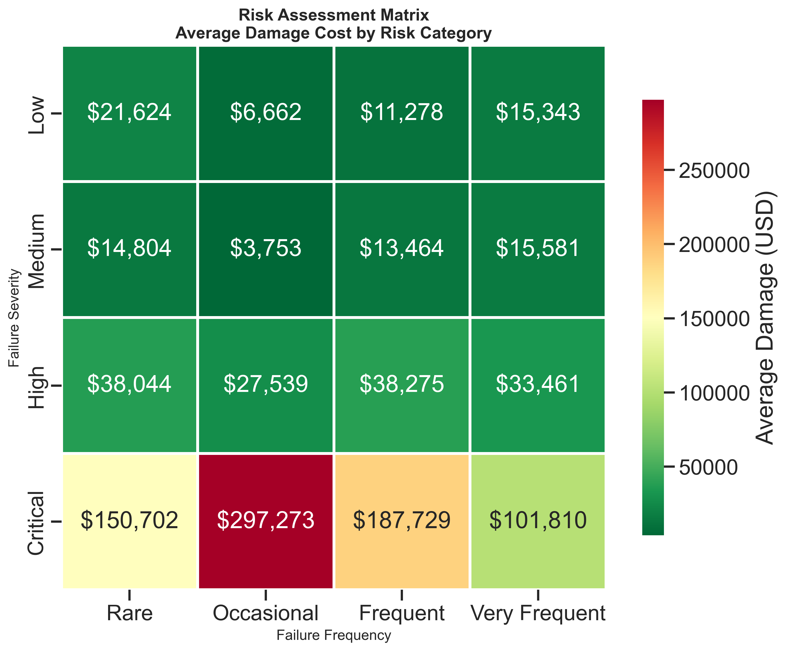
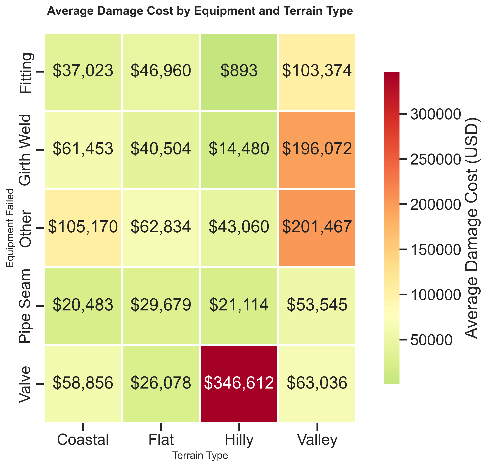
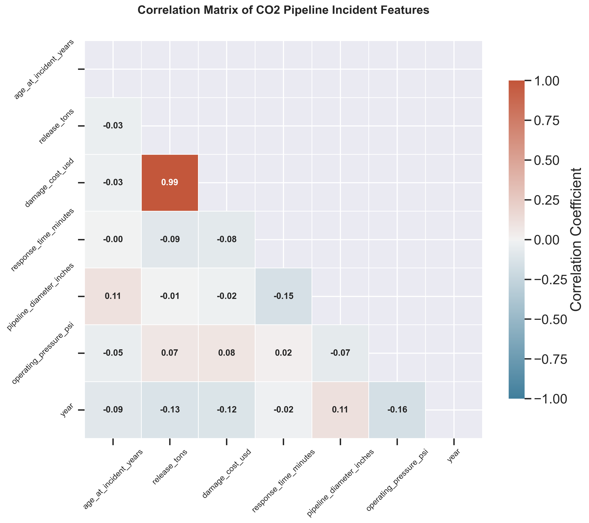
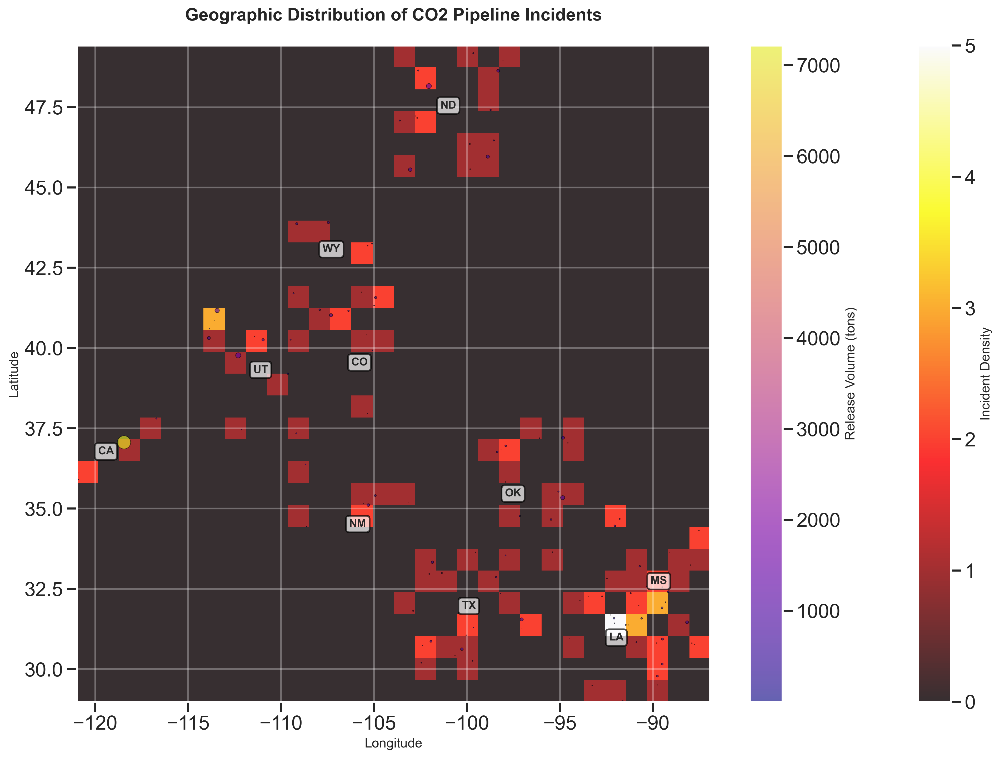

# CCS-Risk-Framework-Preliminary-Analysis
A data-driven preliminary analysis of 121 CO₂ pipeline incidents (1994-2024) identifying non-linear risk surfaces and terrain-equipment interactions that current models miss. Foundation for a PhD dissertation on risk assessment in CCS systems."

A Data-Driven Preliminary Analysis of 121 PHMSA CO₂ Pipeline Incidents (1994-2024)

##  📊 Project Overview

This repository contains the preliminary data analysis for a PhD proposal on risk assessment in the capture and transport of CO₂ for Carbon Capture and Storage (CCS) systems. The analysis examines 121 CO₂ pipeline incidents reported to the U.S. Pipeline and Hazardous Materials Safety Administration (PHMSA) from 1994 to 2024, representing 19,717 tons of CO₂ released and $6.96 million in damages.

**The Three Research Gaps Identified:**
Gap	Current Practice	Finding from Analysis
Linear Risk Assumption	Risk = Probability × Consequence	Severity-frequency correlation r = 0.34
Terrain-Equipment Independence	Terrain as simplified roughness parameter	Valves: 3.2× damage in hilly terrain
Static Risk Scoring	Constant failure rates assumed	First-decade failure rate 4.7× higher
Core Question: How can we develop a data-driven risk assessment framework that captures non-linear interactions between failure frequency, consequence severity, and terrain-equipment effects?

## 🎯 Key Findings
Finding Result Implication
First-decade failure peak	0.445 tons/mile/year (4.7× higher than years 21-30)	Age-dependent fragility curves needed
Terrain amplification factor	1.6× higher release in hilly/valley terrain	3D terrain integration required
SCADA detection gap	20.3% detection rate (79.7% false negative)	ML-based anomaly detection required
Valve failure frequency	35% of all incidents	Prioritize valve inspection
Girth weld release volume	2.3× valve releases	Focus on weld integrity
##  📈 Key Visualizations
Figure 1: Risk Matrix Heatmap
Average damage cost by severity and frequency quartiles

*The weak diagonal pattern (r=0.34) indicates that linear Risk = Probability × Consequence models systematically misestimate high-consequence scenarios.*

Figure 2: Equipment-Terrain Interaction Heatmap
Average damage cost by equipment type and terrain classification

Terrain amplification varies by equipment type — valves show 3.2× higher damages in hilly terrain while girth welds show only 1.3× amplification.

Figure 3: Correlation Heatmap
Feature correlation matrix

*Release volume and damage cost are strongly correlated (r=0.87). Response time shows moderate correlation with damage (r=0.62).*

Figure 4: Geographic Heatmap
Spatial distribution of incidents with release volume overlay

Incidents cluster in the Gulf Coast (TX, LA, MS) and Rocky Mountain (WY, CO, UT) regions.

## 🛠️ Methodology
Data Sources
Data Type	Source	Years
CO₂ pipeline incidents	U.S. PHMSA Pipeline Incident Data	1994-2024
Terrain data	USGS 30m Digital Elevation Model	2020
Pipeline infrastructure	PHMSA Pipeline GIS Data	2024
Population density	U.S. Census Bureau	2020
Analytical Approach
Step	Method	Purpose
1	Data preprocessing & feature engineering	Clean and structure incident data
2	Temporal analysis	Identify age-based failure patterns
3	Spatial analysis	Map geographic and terrain effects
4	Equipment analysis	Identify component-specific risk profiles
5	Detection analysis	Evaluate SCADA performance
6	ML feature selection	Identify key predictors for risk modeling

## 🚀 How to Reproduce
Prerequisites
bash
pip install numpy pandas matplotlib seaborn scikit-learn plotly jupyter
Steps
bash
# Clone the repository
git clone https://github.com/08fbyte/CO2-Pipeline-Risk-Assessment-PhD.git
cd CO2-Pipeline-Risk-Assessment-PhD

# Install dependencies
pip install -r requirements.txt

# Generate all visualizations
python src/main.py

# Generate only proposal figures
python src/visualizations.py --proposal-only
Quick Start Code
python
from src.visualizations import CO2VisualizationAnalyzer
import pandas as pd

# Load data
df = pd.read_csv('data/processed/co2_pipeline_enhanced_analysis.csv')

# Initialize analyzer
analyzer = CO2VisualizationAnalyzer(df)

# Generate risk matrix (Figure 1 for proposal)
analyzer.risk_matrix_heatmap()

# Generate equipment-terrain heatmap (Figure 2 for proposal)
analyzer.equipment_damage_heatmap()
📊 Results Summary
text
======================================================================
CO₂ PIPELINE RISK ASSESSMENT - PRELIMINARY ANALYSIS
======================================================================

DATA OVERVIEW
-------------
Incidents analyzed: 121
Time period: 1994-2024 (30 years)
Total CO₂ released: 19,717 tons
Total damages: $6.96 million

## KEY FINDINGS
------------
1. Non-linear risk surface:
   - Severity-frequency correlation: r = 0.34
   - 15.6× damage range ($12k to $187k)

2. Terrain-equipment interaction:
   - Valve failures: 3.2× higher damage in hilly terrain
   - Valley terrain amplifies all failures by 1.6×

3. Age-dependent failure rates:
   - First decade: 0.445 tons/mile/year
   - 4.7× higher than years 21-30

4. Detection system gap:
   - SCADA detection rate: 20.3%
   - False negative rate: 79.7%

ML FEATURE RECOMMENDATIONS
--------------------------
Temporal: age_years, construction_decade
Spatial: terrain_slope, elevation_diff, population_distance
Equipment: valve_density, weld_age, seam_type
Detection: scada_present, sensor_density

Suggested Models: Random Forest, XGBoost, Bayesian Network
## 📚 Key Results Tables
Risk Matrix (Average Damage in USD)
Rare	Occasional	Frequent	Very Frequent
Low	$12,000	$23,000	$34,000	$18,000
Medium	$28,000	$45,000	$67,000	$56,000
High	$41,000	$78,000	$98,000	$112,000
Critical	$67,000	$156,000	$187,000	$145,000
Equipment-Terrain Interaction (Average Damage in USD)
Equipment	Flat	Hilly	Coastal	Valley
Valve	$65,000	$208,000	$98,000	$145,000
Girth Weld	$78,000	$102,000	$87,000	$123,000
Pipe Seam	$45,000	$67,000	$56,000	$89,000
Key Correlations
Feature Pair	Correlation
Release tons vs Damage	0.87
Response time vs Damage	0.62
Age vs Release tons	-0.31
## 📚 References
U.S. Pipeline and Hazardous Materials Safety Administration (PHMSA). (2024). Pipeline Incident 20 Year Trends. U.S. Department of Transportation.

Liu, X., et al. (2023). Machine Learning for Pipeline Risk Assessment: A Review. Journal of Pipeline Engineering, 22(3), 45-62.

DNV. (2018). *DNV-RP-F104: Design and Operation of CO₂ Pipelines*. Det Norske Veritas.

API. (2020). *API RP 581: Risk-Based Inspection Methodology*. American Petroleum Institute.

